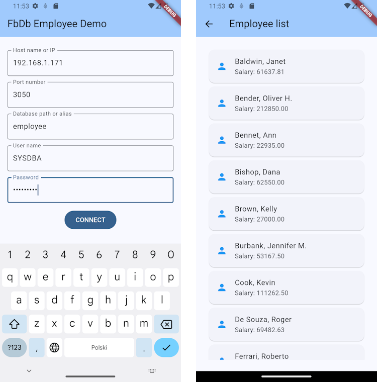

# fbdbmobdemo

A demo application, showing how to implement and deploy an Android application, which uses the [fbdb](https://github.com/hipercompl/fbdb) database access library.

## Description

This is a farly simple application, making use of the *employee* database, which should be available in every standard installation of the [Firebird](https://firebirdsql.org) server.

The application allows the user to enter database location and user credentials.

It then attempts to attach to the *employee* database (or any other specified database with a compatible structure) and retrieves the list of employees, together with their salaries.



## Building and running
First, clone the repository:
```bash
git clone https://github.com/hipercompl/fbdbmobdemo
cd fbdbmobdemo
```
Next, install all dependencies:
```bash
flutter pub get
```

To run the application in an Android emulator or on a real Android device, look up the device ID:
```bash
adb devices
```
and start the application with:
```bash
flutter run -d <your device ID>
```

## Deployment
The application already includes the native client libraries from the official Firebird 5.0 for Android distribution, so there's no need to install / copy them separately.

The libraries are placed in the `android/app/src/main/jniLibs` subdirectory of the project directory. There are shared libraries for all supported architectures:
- arm64-v8a
- armeabi-v7a
- x86
- x86_64

To upgrade the libraries to a different version, download the official Android build of the Firebird server, extract the appropriate dynamic libraries from the downloaded archive, and place them in the directories mentioned above (making sure the directory names and the actual architectures of the dynamic libraries match).

## More information
For more information about the *fbdb* project, please visit the [official fbdb repository](https://github.com/hipercompl/fbdb).

## License
The application is licensed under a BSD-3 license (see the [LICENSE](https://github.com/hipercompl/fbdb/blob/main/LICENSE) file).

## Changelog
- 1.0.1: upgraded Firebird client libraries for Android to version 5.0.1 (snapshot), due to Firebird 5.0 [issue 8110](https://github.com/FirebirdSQL/firebird/issues/8110). The shared libraries from the snapshot work fine on Android 14 (tested with a physical device).
- 1.0.0: the first public release.